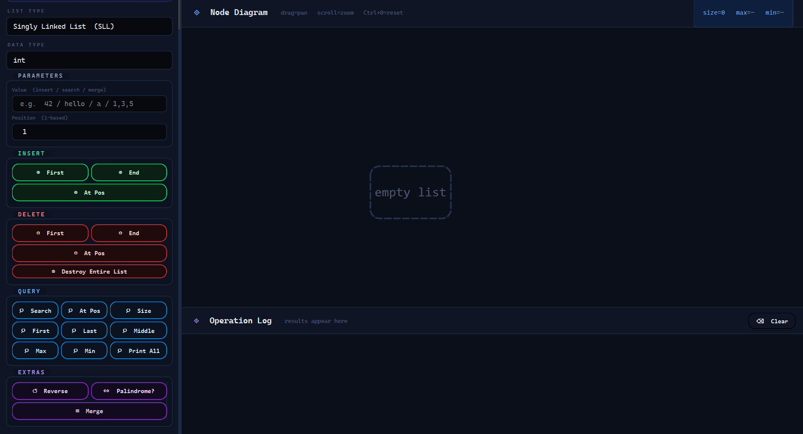
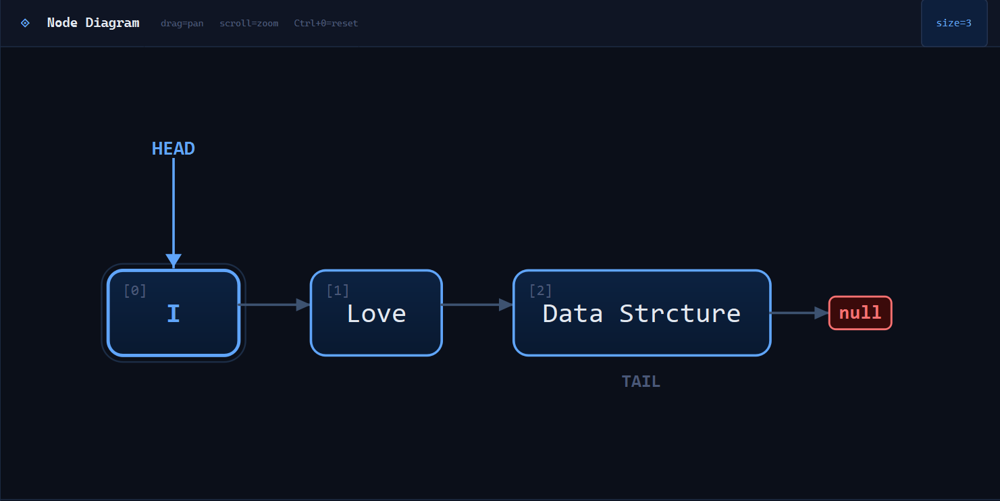
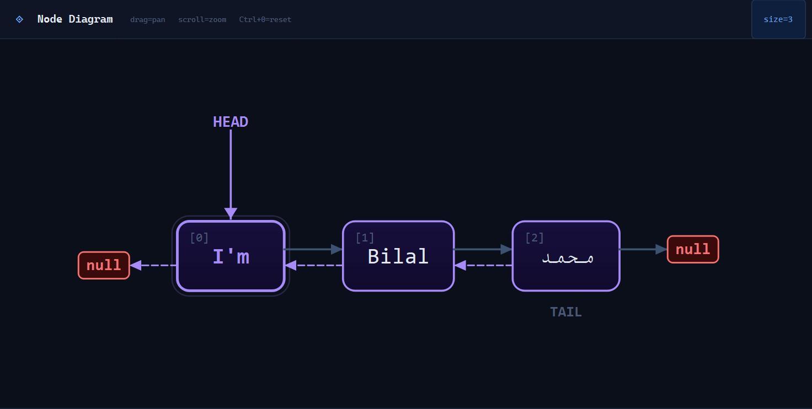
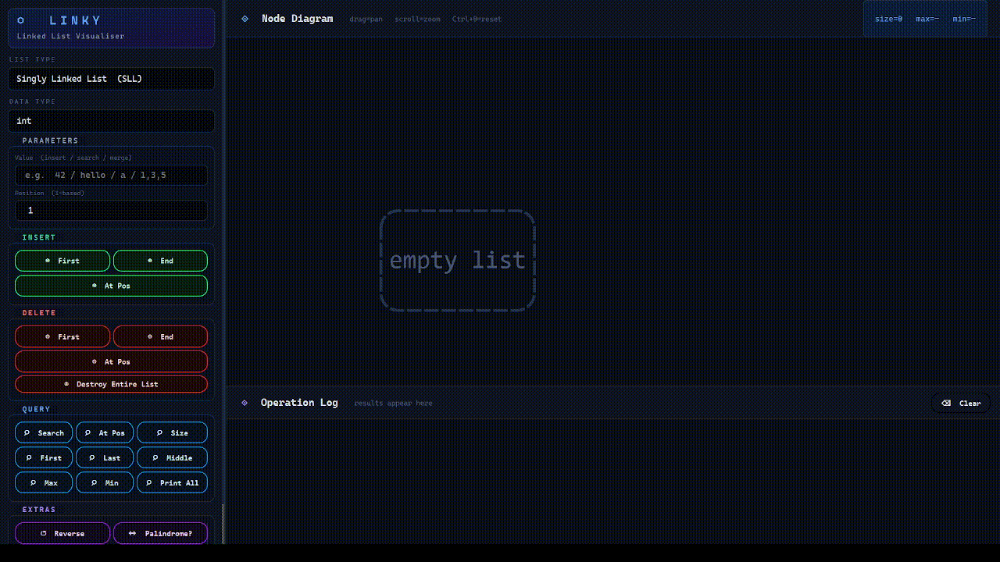

# Linky App

<p align="center">
  
</p>

<p align="center">
  <b>Modern Linked List Visualization Application built with C++ & Qt</b>
</p>

<p align="center">
  
  
  
  
</p>

---

> Interactive educational project for visualizing Singly and Doubly Linked Lists using C++ and Qt.

---

# Overview

Linky App is a desktop application built with **C++** and **Qt** that provides real-time visualization and interaction with:

- Singly Linked List
- Doubly Linked List

It helps in understanding data structures through a graphical and interactive interface.

---

# Features

## GUI Features
- Modern Qt-based interface
- Real-time node visualization
- Smooth and responsive design
- Separate modes for SLL and DLL
- Safe input handling

---

## Operations

### Insertion
- Insert at beginning
- Insert at specific position
- Insert at end

### Deletion
- Delete from beginning
- Delete at specific position
- Delete at end

### Retrieval
- First element
- Middle element
- Last element
- Element by index
- Maximum value
- Minimum value
- Size of list

### Other Operations
- Search value
- Display list
- Reset list
- Check if empty

### Advanced Features
- Reverse list
- Merge lists
- Palindrome check

---

# Architecture

| Component | Description |
|-----------|-------------|
| LinkedList<T> | Abstract base class |
| SingleLinkedList<T> | Singly linked list implementation |
| DoubleLinkedList<T> | Doubly linked list implementation |
| SingleNode<T> | Node structure for SLL |
| DoubleNode<T> | Node structure for DLL |
| ListController<T> | Logic controller |
| Widget | Qt UI & visualization |

---

# Design Highlights

- Object-Oriented Programming (OOP)
- Template-based Generic Design
- Modular Architecture
- Separation of Concerns
- Real-time Visualization
- Scalable Code Structure

---

# Screenshots

## Main Interface
<p align="center">
  
</p>

---

## Singly Linked List
<p align="center">
  
</p>

---

## Doubly Linked List
<p align="center">
  
</p>

---

# Demo

<p align="center">
  
</p>

---

# Technologies

| Tech | Purpose |
|------|--------|
| C++ | Core logic |
| Qt | GUI framework |
| CMake | Build system |
| Visual Studio / Qt Creator | Development |

---

# How to Run

## Qt Creator (Recommended)
1. Open project folder
2. Load `CMakeLists.txt`
3. Configure project
4. Build project
5. Run application

---

## Terminal (CMake)

### Build
```bash
mkdir build
cd build
cmake ..
cmake --build .